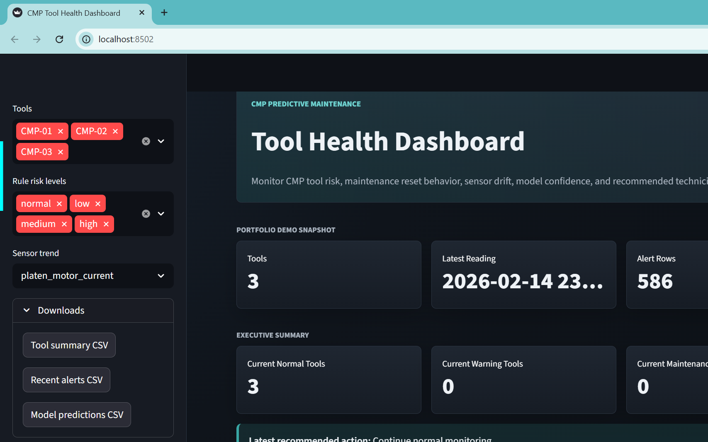

# PlanarIQ CMP Equipment Intelligence Platform

Industrial-style CMP equipment intelligence platform for semiconductor tool health, fault detection, predictive maintenance, technician execution, PM planning, and operations reporting.



Live dashboard:
https://cmp-predictive-maintenance.streamlit.app

## Project Story

I built PlanarIQ, a CMP predictive maintenance workflow that simulates tool sensor data, identifies abnormal equipment trends, predicts maintenance risk, and recommends practical maintenance checks before failures cause downtime.

The project answers:

- Which CMP tool is showing abnormal behavior?
- Which sensor trends suggest degradation?
- What maintenance action should be checked first?
- How urgent is the issue?
- How would early detection reduce downtime or scrap risk?

## Why This Matters

CMP tools rely on stable mechanical motion, slurry delivery, pressure control, consumable condition, and process monitoring. A tool can begin drifting before a hard fault occurs. Rising motor current, elevated vibration, low slurry flow, alarm bursts, and worn consumables can all point toward maintenance risk.

This project turns those equipment signals into technician-focused outputs:

- Rule-based alerts that are easy to explain
- A machine learning model for maintenance risk classification
- A dashboard for tool health review
- A case study written for interviews and portfolio review

## Data And Confidentiality

This project uses synthetic CMP-style equipment data only. It does not include proprietary fab data, real equipment logs, customer information, employer-owned process data, recipes, tool exports, or confidential maintenance records.

The model accuracy and dashboard outputs should be understood as a portfolio demonstration of predictive maintenance workflow design, not as a production fab model.

## Usage Rights

This project is shared for portfolio and educational review. All rights are reserved. See `LICENSE` for details.

## Current Results

Latest tool priority:

| Tool | Current Risk | Maintenance State | Rule Points | Recommended Focus |
| --- | --- | --- | ---: | --- |
| CMP-01 | Normal | normal | 0 | Continue normal monitoring after PM reset |
| CMP-02 | Normal | normal | 0 | Continue normal monitoring after PM reset |
| CMP-03 | Normal | normal | 0 | Continue normal monitoring after PM reset |

Dataset and alert summary:

- 3,240 synthetic CMP sensor rows
- 3 simulated CMP tools
- 586 rule-based alert rows
- 6 simulated maintenance events with post-maintenance reset behavior
- Labels: normal, warning, maintenance_needed

Model summary:

- Model: Random forest classifier
- Test accuracy: 99.9%
- Target: `maintenance_state`
- Top features: sensor threshold count, process drift trend, retaining ring life, wafer removal rate trend, pad life

## Dashboard

The Streamlit dashboard shows:

- Current tool priority
- Industrial Product Console with role context, persistent tickets, configurable thresholds, and audit trail
- Streamlined product navigation with executive, industrial ops, fab simulation, technician workflow, and model analytics workspaces
- System status and data freshness bar with runtime clock, source timestamp, feed mode, and integration state
- Deployment readiness workspace with data contract, integration points, threshold configuration, and validation checklist
- Ticket detail drilldowns, role-based permissions, threshold-driven scoring, and CSV ingestion
- Fab Command Center with live-feed simulation, downtime, scrap, incident replay, scenario simulation, model quality, reports, and executive summary views
- Technician Troubleshooting Mode with likely causes, checks, urgency, and business impact
- Root-cause probability estimates for each selected CMP tool
- Before-vs-after maintenance reset behavior
- Maintenance calendar estimates for pad and retaining-ring PM planning
- Mock maintenance ticket generation
- Technician action logging with before/after risk closeout
- Shift handoff text for technician communication
- Rule-based AI Maintenance Assistant for asking what to check
- Interview explanation page for presenting the project clearly
- Risk level by tool
- Recommended technician checks
- Sensor trend charts
- Maintenance event timeline
- Recent alert rows
- Model predictions
- Model confidence and technician review priority
- Feature importance
- Model metrics
- Downloadable CSV exports for technician handoff

### Live Dashboard

Open the live dashboard here:

```text
https://cmp-predictive-maintenance.streamlit.app
```

Portfolio viewers can interact with the filters, charts, tables, and downloads
directly in the browser.

Local launch:

```powershell
.\.venv\Scripts\Activate.ps1
streamlit run .\src\dashboard.py --server.port 8502
```

Then open:

```text
http://localhost:8502
```

## Project Outputs

- `reports/cmp_predictive_maintenance_case_study.md`: job-ready case study
- `reports/demo_script.md`: interview and dashboard presentation script
- `reports/interview_explanation.md`: concise interview explanation page
- `reports/social_launch_kit.md`: LinkedIn post, GitHub topics, and demo video script
- `reports/maintenance_alert_report.md`: technician-focused alert report
- `reports/model_metrics.md`: model performance and interpretation
- `reports/model_feature_importance.csv`: feature importance values
- `reports/tool_health_summary.csv`: latest tool health snapshot
- `data/raw/synthetic_cmp_tool_data.csv`: generated synthetic CMP sensor data
- `data/processed/cmp_feature_table.csv`: cleaned feature table
- `data/processed/cmp_alerts.csv`: rule-based alert rows
- `data/processed/cmp_model_predictions.csv`: model predictions
- `models/cmp_maintenance_risk_model.joblib`: trained model artifact

## Project Workflow

```text
Synthetic CMP data
  -> Cleaned feature table
  -> Technician-readable rule alerts
  -> Maintenance risk model
  -> Dashboard and case study
```

## Equipment Signals Modeled

- Platen motor current
- Carrier motor current
- Slurry flow rate
- Downforce pressure
- Pad usage hours
- Retaining ring usage hours
- Vibration
- Tool temperature
- Alarm count
- Wafer removal rate
- Process drift
- Maintenance event flag
- Maintenance state

## Rule-Based Alert Examples

The baseline alert logic checks for CMP conditions a technician could reason through:

- High platen motor current with elevated vibration
- Low slurry flow
- High pad usage with elevated vibration
- Downforce pressure outside expected range
- Multiple alarms in the same hour
- Removal-rate or process-drift abnormality

These rules produce practical recommended actions such as checking slurry delivery, platen drive behavior, carrier load, vibration source, pad condition, conditioner performance, retaining ring wear, removal-rate drift, endpoint data, process recipe inputs, and recent alarm history.

## How To Run The Project

Run the full project pipeline and launch the dashboard:

```powershell
.\run_project.ps1
```

Run the pipeline without opening the dashboard:

```powershell
.\run_project.ps1 -NoDashboard
```

Skip dependency installation if packages are already installed:

```powershell
.\run_project.ps1 -SkipInstall
```

Manual steps are listed below for transparency.

Create and activate the virtual environment:

```powershell
python -m venv .venv
.\.venv\Scripts\Activate.ps1
```

Install dependencies:

```powershell
pip install -r requirements.txt
```

Generate synthetic CMP data:

```powershell
python .\src\generate_synthetic_cmp_data.py
```

Build the cleaned feature table and rule alert outputs:

```powershell
python .\src\build_cmp_feature_table.py
```

Generate the technician maintenance alert report:

```powershell
python .\src\generate_maintenance_alert_report.py
```

Train the maintenance risk model:

```powershell
python .\src\train_maintenance_risk_model.py
```

Launch the dashboard:

```powershell
streamlit run .\src\dashboard.py --server.port 8502
```

Or open the live dashboard:

```text
https://cmp-predictive-maintenance.streamlit.app
```

## Project Structure

```text
CMP-Predictive-Maintenance/
  data/
    raw/
      synthetic_cmp_tool_data.csv
    processed/
      cmp_feature_table.csv
      cmp_alerts.csv
      cmp_model_predictions.csv
  models/
    cmp_maintenance_risk_model.joblib
  reports/
    cmp_glossary.md
    cmp_predictive_maintenance_case_study.md
    demo_script.md
    social_launch_kit.md
    maintenance_alert_report.md
    model_feature_importance.csv
    model_metrics.md
    tool_health_summary.csv
  src/
    build_cmp_feature_table.py
    dashboard.py
    generate_maintenance_alert_report.py
    generate_synthetic_cmp_data.py
    train_maintenance_risk_model.py
  run_project.ps1
  .gitignore
  LICENSE
  PROJECT_PLAN.md
  README.md
  requirements.txt
```

## Interview Talking Point

I would describe the project this way:

> I built a CMP predictive maintenance project that simulates tool sensor data, identifies abnormal trends, and recommends maintenance checks before failures cause downtime. I started with rule-based alerts for conditions a technician would recognize, like high motor current with rising vibration or low slurry flow. Then I trained a simple model to classify tool states as normal, warning, or maintenance-needed. Finally, I built a dashboard that shows tool health, recent alerts, sensor trends, model predictions, and recommended technician actions.

Upgraded version:

> I built a CMP predictive maintenance system that simulates tool sensor data, detects abnormal trends, estimates maintenance risk, suggests probable root causes, and generates technician-focused troubleshooting reports and shift handoffs.

The dashboard also includes a mock maintenance ticket generator and technician action log so the workflow shows what happened after the alert, not only that an alert occurred.

Expanded version:

> I built a CMP predictive maintenance command center with technician troubleshooting, root-cause analysis, PM planning, ticketing, cost impact simulation, incident replay, and interactive what-if diagnostics.

Industrial product version:

> I built an industrial-style CMP equipment health platform with persistent maintenance tickets, technician action history, configurable alert thresholds, audit logging, predictive maintenance scoring, PM planning, root-cause guidance, cost impact reporting, and shift handoff support.

Latest product upgrade:

> The platform now includes a simulated live sensor feed, model quality monitor, and downloadable operations report so supervisors can review risk, maintenance planning, model confidence, and technician activity from one product console.

Current product hardening:

> The app now supports role-based actions, ticket detail review, persisted threshold settings that drive scenario/live scoring, uploaded CSV validation and scoring, and product-area navigation for a more enterprise-style workflow.

Professional UI cleanup:

> The dashboard now opens into a clean executive overview and routes specialist users into dedicated workspaces instead of forcing every module into one long page. The visual design uses a lighter industrial console style suitable for presenting to a semiconductor fab audience.

## Limitations

This project uses synthetic data, so the model result should be treated as a portfolio demonstration rather than a production fab model. A real deployment would need real equipment logs, maintenance event history, process context, validation with engineers and technicians, and controls for false alarms.

## Next Improvements

- Add false-alarm review thresholds and alert suppression after PM.
- Connect the dashboard to exported historian or equipment log data.
